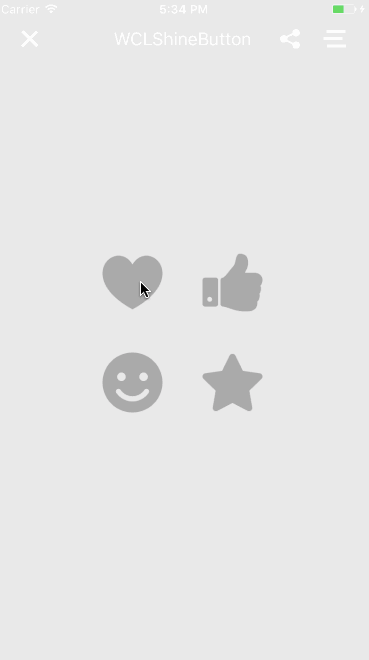

[TOC]
# S0009_WCLShineButton


##简介：
WCLShineButton，用CAAnimation写的按钮动画，供大家学习交流使用，已封装好也可以用到项目里面使用

|   demo信息   | 详情                                       |
| :--------: | :--------------------------------------- |
|  DemoName  | WCLShineButton                           |
|    CRID    | S0009                                    |
|   author   | [WCL](https://github.com/631106979)      |
| authorMail | wangchonhlei93@icloud.com                |
|  源gitHub   | https://github.com/631106979/WCLShineButton |
|    其他说明    | http://blog.csdn.net/wang631106979/article/details/55230455 |

## 使用：

```swift
var param1 = WCLShineParams()
param1.bigShineColor = UIColor(rgb: (153,152,38))
param1.smallShineColor = UIColor(rgb: (102,102,102))
let bt1 = WCLShineButton(frame: .init(x: 100, y: 100, width: 60, height: 60), params: param1)
bt1.fillColor = UIColor(rgb: (153,152,38))
bt1.color = UIColor(rgb: (170,170,170))
bt1.addTarget(self, action: #selector(action), for: .touchUpInside)
view.addSubview(bt1)
```

### 属性列表

| **属性**                  | **描述**         |
| ----------------------- | -------------- |
| `color`                 | button的默认颜色    |
| `fillColor`             | button的填充颜色    |
| `allowRandomColor`      | 允许shine的颜色随机   |
| `animDuration`          | 动画的时间          |
| `bigShineColor`         | 大太阳的颜色         |
| `enableFlashing`        | 是否需要flash的效果   |
| `shineCount`            | 太阳的个数          |
| `shineTurnAngle`        | 太阳的旋转角度        |
| `shineDistanceMultiple` | 太阳的扩散范围        |
| `smallShineOffsetAngle` | 小太阳和大太阳之前的偏移角度 |
| `smallShineColor`       | 小太阳的颜色         |
| `shineSize`             | 大太阳的半径         |
| `colorRandom`           | 太阳的颜色的数组       |
| `image`                 | button的image   |
